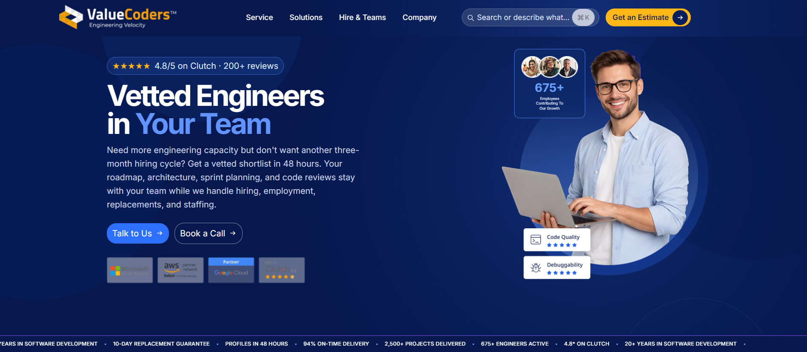

# 🚀 Vinove Frontend Assignment

<p align="center">
  <strong>A responsive and modern frontend implementation developed as part of the Vinove assignment.</strong>
</p>

<p align="center">
  <a href="https://assignment-vinove.netlify.app/">
    
  </a>
  <a href="https://github.com/prabhatrana666/Assignment-Vinove">
    
  </a>
</p>

<p align="center">
  <a href="#-overview">Overview</a> •
  <a href="#-live-demo">Live Demo</a> •
  <a href="#-features">Features</a> •
  <a href="#-tech-stack">Tech Stack</a> •
  <a href="#-getting-started">Getting Started</a>
</p>

---

## 📌 Overview

This project was developed as part of the **Vinove frontend assignment**.

The implementation focuses on creating a clean, responsive, and user-friendly interface while maintaining reusable components, structured code, responsive layouts, and a consistent visual design across desktop, tablet, and mobile devices.

---

## 🌐 Live Demo

<p align="center">
  <a href="https://assignment-vinove.netlify.app/">
    
  </a>
</p>

**Live Website:**  
https://assignment-vinove.netlify.app/

---

## 🎥 Preview

<p align="center">
  
</p>


---

## ✨ Features

- 📱 **Responsive Design** — Optimized for desktop, tablet, and mobile devices
- 🎨 **Modern UI** — Clean and professional visual design
- 🧩 **Reusable Components** — Structured React components for maintainability
- 🚀 **Performance Focused** — Lightweight and optimized frontend implementation
- 📐 **Responsive Layout** — Flexible layouts across different screen sizes
- 🖱️ **Interactive UI** — Smooth navigation and user interactions
- ♿ **Accessibility** — Semantic HTML and accessible interface elements
- 🌐 **Cross-Browser Support** — Designed to work across modern browsers

---

## 🛠️ Tech Stack

### Frontend

<p>
  
  
  
  
</p>

### UI & Styling

<p>
  
  
</p>

### Development Tools

<p>
  
  
  
  
</p>

---

## 🚀 Getting Started

### Prerequisites

Make sure you have the following installed:

- Node.js
- npm
- Git
- VS Code or any preferred code editor

### 1. Clone the Repository

```bash
git clone https://github.com/prabhatrana666/Assignment-Vinove.git```
cd Assignment-Vinove
```

### 2. Install Dependencies

```bash
npm install
```

### 3. Start the Development Server

```bash
npm npm run dev
```
## 🔗 Connect

<p align="left">
  <a href="https://prabhatrana.online/">
    
  </a>

  <a href="https://linkedin.com/in/prabhat-rana">
    
  </a>

  <a href="https://github.com/prabhatrana666">
    
  </a>

  <a href="mailto:prabhatrana.dev@gmail.com">
    
  </a>
</p>

---

## 📄 License

This project was developed as part of the **Vinove frontend assignment**.

© 2026 **Prabhat Rana**. All rights reserved.

---

<p align="center">
  <a href="https://assignment-vinove.netlify.app/">
    🌐 Live Assignment
  </a>
  &nbsp;•&nbsp;
  <a href="https://github.com/prabhatrana666/Assignment-Vinove">
    💻 GitHub
  </a>
  &nbsp;•&nbsp;
  <a href="https://prabhatrana.online/">
    🌐 Portfolio
  </a>
  &nbsp;•&nbsp;
  <a href="https://linkedin.com/in/prabhat-rana">
    💼 LinkedIn
  </a>
</p>

<p align="center">
  <sub>Designed and developed by Prabhat Rana.</sub>
</p>